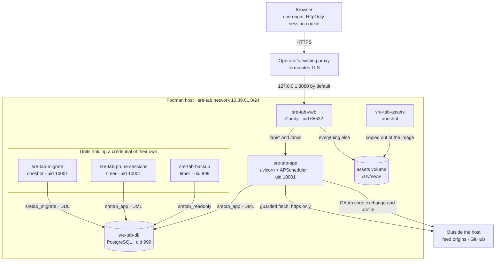
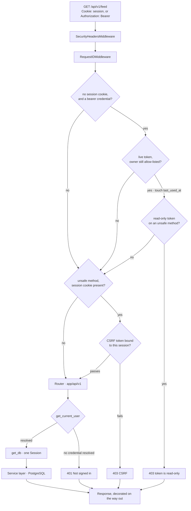
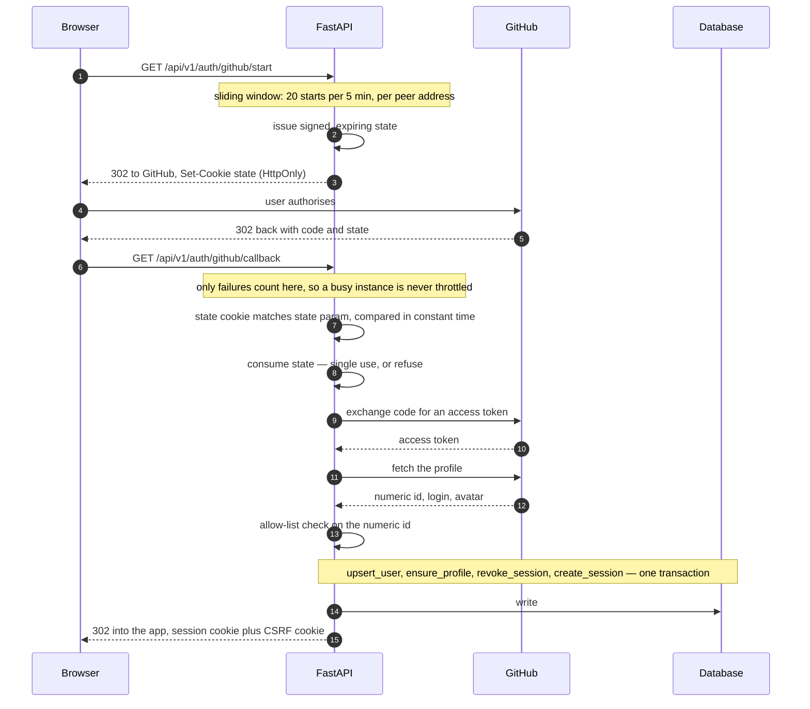
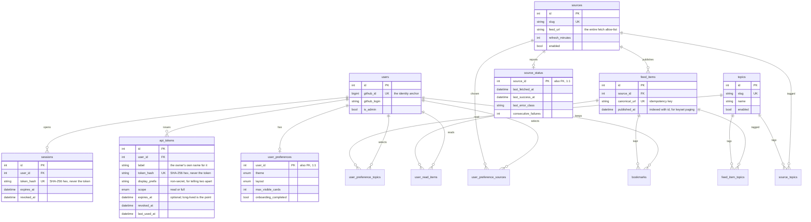
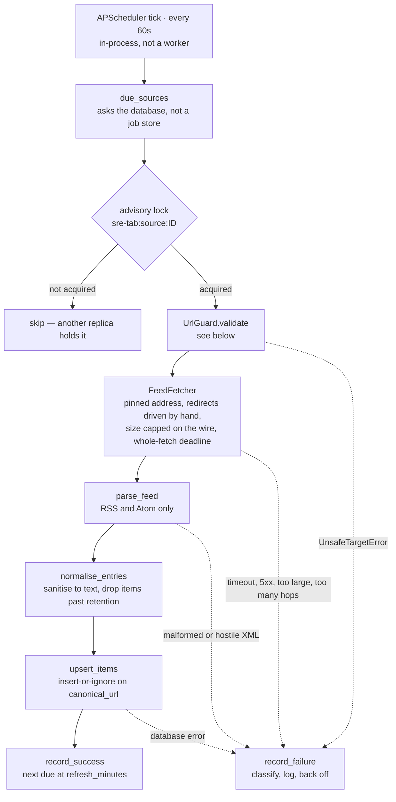
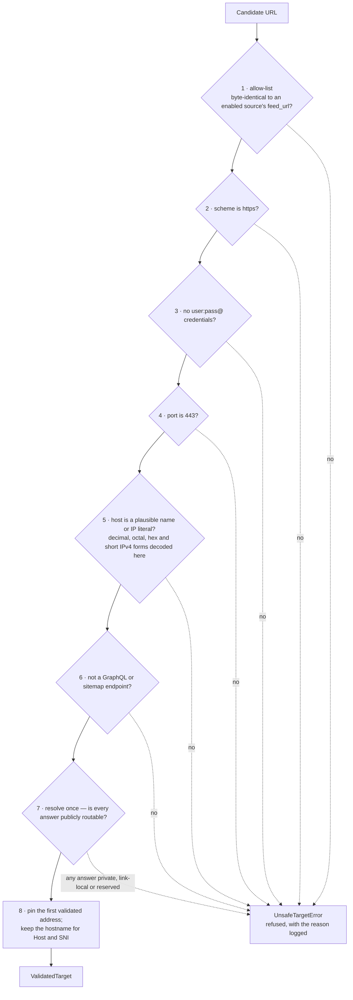
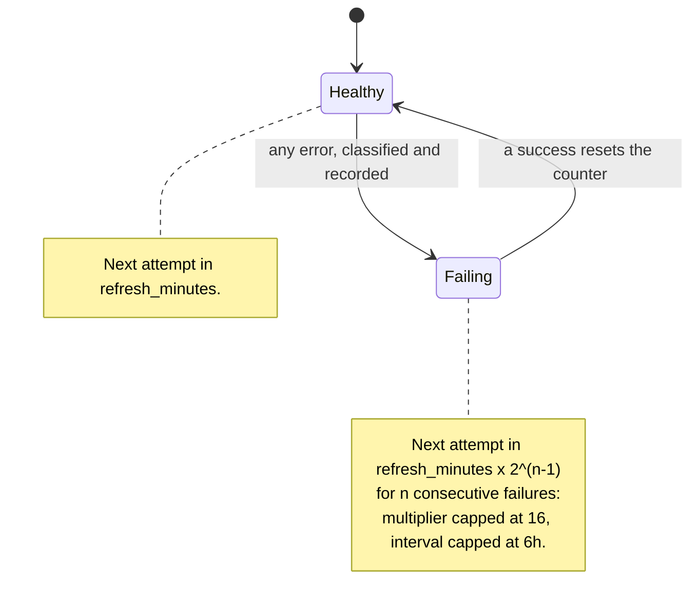
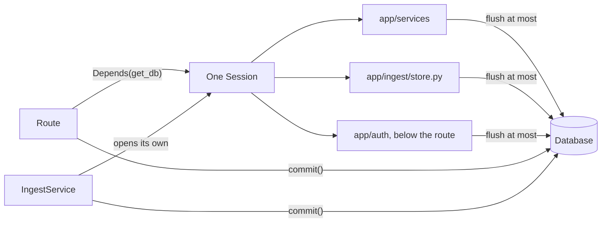
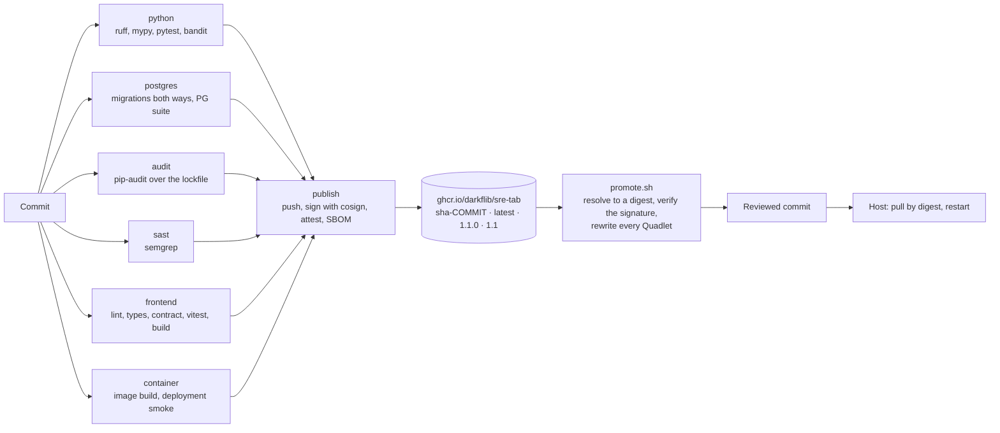

# Architecture

The shape of the system, and the reasoning underneath it: what the pieces
are, how a request moves through them, and — the part that is usually
missing — *where* each property this service claims is actually enforced.

This is a map, not a specification. [prd-v1.md](prd-v1.md) owns scope and
acceptance criteria, [deploy/README.md](deploy/README.md) owns operations,
[AGENTS.md](AGENTS.md) owns the invariants as rules rather than as pictures,
and where any of them disagrees with this file, this file is the one that is
wrong.

Every diagram is Mermaid, rendered inline by GitHub and by most editors. They
are drawn from the code rather than from memory, and each is followed by the
sentence it exists to make legible — a diagram that needs no prose is usually
a diagram that says nothing. CI parses all of them on every push, which keeps
them renderable and proves nothing whatever about whether they are true or
readable; [CONTRIBUTING.md](CONTRIBUTING.md#diagrams-parse-but-are-not-read)
has the distinction, and it is a wider gap than it sounds.

| Section | What it answers |
| --- | --- |
| [The whole thing at once](#the-whole-thing-at-once) | What runs, as what user, talking to what |
| [A request, end to end](#a-request-end-to-end) | What a `GET /api/v1/feed` actually passes through |
| [Signing in](#signing-in) | Where the allow-list bites, and what a session costs |
| [The data model](#the-data-model) | Thirteen tables, and why `source_status` is not a column |
| [Refreshing a source](#refreshing-a-source) | The tick, the lock, and the per-source blast radius |
| [The SSRF guard](#the-ssrf-guard) | Eight checks, in order, and what each one closes |
| [When a source is failing](#when-a-source-is-failing) | Back-off, and why `failing (1)` is not an outage |
| [Transactions](#transactions) | Who commits, and why nothing below a route does |
| [The client](#the-client) | One origin, a generated client, and a CSP with no inline anything |
| [From commit to running host](#from-commit-to-running-host) | Six gates, a signature, and a digest |
| [Where each property is enforced](#where-each-property-is-enforced) | The table to read before changing anything |

## The whole thing at once

Three things in that picture are load-bearing and easy to read past.

**Only Caddy publishes a port, and only to `127.0.0.1`.** 8080 is the default
rather than the policy — `SRE_TAB_WEB_PORT` in `/etc/sre-tab/install.env`
moves it, and the host's TLS proxy then has to be told, which is the one end
of this the repository cannot reach. The database is not reachable from the
host at all, let alone from outside it. Every hop inside the box is by
container name, which is why a host missing `aardvark-dns` produces a psycopg
error out of the migration unit and looks exactly like a database that is
down — see [deploy/README.md](deploy/README.md).

**Four units talk to PostgreSQL and none of them is a superuser.** The
application and the session sweep hold DML only, the migration unit holds DDL
and owns the tables, the backup is read-only, and none of the three roles
can `COPY … TO PROGRAM`. That was a finding, and closing it is what
[deploy/ROLES.md](deploy/ROLES.md) documents.

**The built client ships inside the application image**, and a oneshot copies
it into the volume Caddy reads. The alternative — a second image carrying
Caddy and the assets — would put two artefacts on one floating tag, and
therefore create a window in which a new API serves an old bundle. One image,
one digest, no skew.

## A request, end to end

**The middleware order is the reverse of the registration order**, because
Starlette wraps. `app/main.py:create_app` adds CSRF, then the API-token
middleware, then request-ID, then security headers, which puts security
headers outermost and CSRF closest to the router. That is the arrangement you want: a CSRF rejection travels back
out through the other two, so a 403 carries the same headers and the same
request id as a 200. A guard that produces undecorated responses is a guard
that produces a second, quieter class of response.

**CSRF is enforced in middleware, not per route, and that is a deliberate
change of granularity.** `Depends(require_csrf)` protects the routes that
remember to ask for it. The middleware protects every mutating request on
every router, including ones written later by someone who never read this
document. It narrows twice, on purpose: only `POST`/`PATCH`/`PUT`/`DELETE`,
and only when the session cookie is present — CSRF is an attack on ambient
authority, and a request carrying no authority has none to abuse.

**That second narrowing is also what exempts an API token, and the exemption
is exact rather than incidental.** `ApiTokenMiddleware` declines to
bearer-authenticate any request carrying the session cookie, so "cookie
present" and "the cookie is what authenticates" are the same condition in
both files. Adding an `Authorization` header to a browser request is
therefore not a way past the CSRF check — it is ignored. The token
middleware sits *outside* CSRF so the identity it resolves is on the request
before either the CSRF layer or the router looks, and so a scope refusal is
decided before the route function exists.

**Token scope is enforced there for the reason CSRF is.** "A read-only token
may not use a mutating method" is a rule every route has to obey, including
ones added later; putting it in a dependency would protect whichever routes
remembered to ask. No route is consulted, so no route can forget. The one
place that rule does *not* reach is a route that mutates on `GET`, which is
the same gap CSRF has and for the same reason.

**`get_current_user` answers the same 401 for absent, forged, revoked, and
expired**, because which one it was is useful to exactly one kind of caller.
An API token that failed to resolve — unknown, malformed, revoked, expired,
or owned by somebody no longer on the allow-list — arrives at the same place
by the same route, having left nothing on the request, so the five refusals
are one refusal rather than five that happen to match.
It also builds a fresh `HTTPException` every time rather than raising a
module-level singleton: each `raise` appends a frame to the object's
traceback, a module global is never collected, and the measured cost was
32,719 bytes pinned per unauthenticated request — around 23,000 requests to
exhaust the unit's `MemoryMax=768M`, on a route that needs no credentials.
`tests/auth/test_exception_identity.py` fails if that reverts.

## Signing in

**The identity anchor is GitHub's numeric id, never the login.** A login can
be changed and reused; an id cannot. That is why `ALLOWED_GITHUB_IDS` takes
numbers, and why an operator's first encounter with this system is often the
403 described in the README: an empty allow-list denies everyone, including
the person who deployed it, and the failure is indistinguishable from a
broken OAuth application.

**The access token's entire life is one expression.** It is used to fetch the
profile and never returned to the caller, stored, or logged. What persists is
a session row holding a SHA-256 digest of the session token — the raw token
exists only in the cookie, so a database copy does not yield anything a
browser could present.

**The four writes are one transaction or they are a half-created account.**
Nothing in `app/auth/` below the route commits, which is what lets the
callback compose them; see [Transactions](#transactions).

## The data model

Fourteen tables: the PRD's twelve entities, plus `source_status` and
`api_tokens`.

**`source_status` is separate from `sources` on purpose.** `sources` is
operator-managed configuration; `source_status` is runtime state written by
the refresh loop. Keeping them apart means the two writers never contend, and
`sources.updated_at` goes on meaning *the operator changed something* rather
than *a feed was polled*. It is also what stops the refresh schedule living
only in one process's memory — a restart or a second replica reads
`last_fetched_at` instead of treating the whole catalogue as due.

**Every join table has a composite primary key**, which is what makes a
repeated client request idempotent rather than a duplicate row: bookmarking
twice is one bookmark, marking read twice is one read.

**`feed_items.canonical_url` is unique, and the write path is
insert-or-ignore.** Re-fetching a feed cannot duplicate an item and cannot
overwrite one; topic links are re-asserted for the whole batch, so a source
that gains a topic picks it up without any item row being rewritten.

**Every relationship declares `lazy="raise"`.** An implicit lazy load in a
request path is not a slow query here, it is an exception — which is how a
sync-only slip is caught in the test suite rather than discovered during a
future async migration.

## Refreshing a source

**One tick, not one job per source.** Sources are rows an operator changes at
runtime. A job-per-source design needs the job store resynchronised on every
change; a tick that asks *what is due?* needs nothing resynchronised, and
handles a source appearing, disappearing, or changing its interval for free.

**`refresh_source` does not raise.** Every failure — DNS, TLS, timeout,
oversized body, hostile XML, a database error — is caught, classified,
recorded against that source alone, and logged. One broken feed cannot stop
the tick, cannot touch another source's items, and cannot delete anything:
the write path is insert-or-ignore and no failure branch deletes.

**The lock is per source, not global.** The requirement is that two replicas
never fetch the same source concurrently, not that one replica does all the
work, so replicas share a tick and collide on nothing. On PostgreSQL these
are session-level advisory locks on a dedicated connection, released
explicitly in a `finally` because a pooled connection carries its locks back
to the pool. On SQLite there is no equivalent, so the lock degrades to
process-local and says so in a warning at start-up rather than pretending —
which is honest, and matches the PRD's split of SQLite for development and
PostgreSQL for production.

## The SSRF guard

Nothing in `app/ingest/urlguard.py` opens a socket. It returns a
`ValidatedTarget` naming exactly which IP address the caller may connect to,
and the fetcher connects to that address and no other. A caller that resolved
the name again independently would reopen the DNS-rebinding hole the module
exists to close.

Four properties of that ordering are worth stating, because each closes
something specific.

**A redirect hop skips step 1 and takes every other check.** A source is
entitled to redirect, so the allow-list cannot apply to hops — but the scheme,
port, host, and resolution checks all do, on every hop, with
`follow_redirects` turned off so that `httpx` never follows one below the
layer we could hook. This is what makes the documented Guardian case a
refusal rather than a downgrade: `https://…/uk/rss/` answers `301` with an
`http://` location, and an https-only guard refuses it at the hop.

**Every address the resolver returns must pass, not merely the first.** One
bad answer in a multi-answer set rejects the whole target, so a split-answer
attack gains nothing.

**The numeric IPv4 forms are decoded in the guard, not left to the
resolver.** `2130706433`, `0177.0.0.1`, `0x7f.0.0.1`, and `127.1` are all
loopback, and whether a given platform's resolver agrees is not something to
depend on.

**The fetcher is built with `trust_env=False`.** An `HTTPS_PROXY` in the
environment would route the connection through a proxy of someone else's
choosing, and a pinned address routed through a proxy is not pinned at all.
Two more bounds live in the fetcher rather than the guard: the size cap is
counted over streamed chunks rather than trusted from `Content-Length`, and
`source_fetch_timeout_seconds` is a deadline for the *whole* fetch, rechecked
between hops and on every chunk — because a per-read timeout lets a server
dribbling one byte at a time hold the connection for max-bytes ÷ dribble-rate,
and the tick refreshes sources serially.

## When a source is failing

The back-off is not politeness for its own sake: a source that is down should
not be polled at its ordinary interval, and a wedged source should not come up
in every tick and dominate it.

**A failing source degrades readiness reporting without failing it.**
`/api/v1/healthz` names the count of failing sources in the scheduler probe's
detail, and stays ready — one broken feed must not take the instance out of a
load balancer. What *does* fail readiness is the scheduler not running, or a
tick more than five intervals old, which is the case where APScheduler still
reports itself alive while no work is happening.

**`sre-tab status` exits non-zero when an enabled source is failing**, so a
monitoring job can call it and mean it. Status persistence is best-effort by
design: it is observability, not the work, so a database that cannot take the
row is logged and ignored rather than failing the refresh over its own
bookkeeping.

## Transactions

One rule, no exceptions: **whoever opens the session owns the transaction.**

A function that *receives* a `Session` never calls `commit()` or `rollback()`
— that is every service in `app/services/`, every helper in
`app/ingest/store.py`, and everything in `app/auth/` below the route. It may
`flush()` when it needs to read its own write back.

`get_db` deliberately does not commit. It closes the session, and closing
rolls back anything uncommitted, so a route that raises before its commit
leaves nothing behind.

The point is composability. A self-committing service cannot be called twice
in one unit of work, and the OAuth callback already needs exactly that: four
calls, one transaction, or a half-created account.

## The client

React 19 and Vite, served same-origin with the API — which is why no CORS
configuration exists anywhere in this project, in development or in
production. In development Vite proxies `/api` to port 8000; in production
Caddy routes `/api/*` and `/docs` to FastAPI and serves everything else from
disk.

**`src/api/schema.d.ts` is generated from the frozen `openapi.json`, not
written.** A contract change therefore surfaces as a TypeScript error rather
than a runtime surprise. That used to be a sentence asking for discipline and
is now a gate in two halves: `tests/test_openapi.py` compares the committed
document against the schema the application serves, and the frontend CI job
regenerates `schema.d.ts` and fails on a diff.

**The CSP has no `'unsafe-inline'`, and the build contains no inline script or
style.** `public/theme-init.js` is a separate same-origin file loaded blocking
in `<head>` so the stored theme resolves before first paint — it must not be
inlined. `assetsInlineLimit` is `0` so nothing else quietly becomes a `data:`
URI either. `img-src 'self' https: data:` is the one deliberate relaxation:
feed images, source icons, and avatars are third-party hosts.

**Caddy sends the same headers for the paths FastAPI never sees.**
`SecurityHeadersMiddleware` only decorates responses the application emits,
and the HTML document — where CSP is actually enforced — is served from disk.
The Caddyfile therefore carries a verbatim mirror of the app's header block,
and `deploy/scripts/check-header-parity.sh` fails CI on drift, because two
copies of a security policy is precisely the shape that rots silently.

## From commit to running host

**All six gates are `needs:` of `publish`.** Nothing reaches the registry
without passing every one, including the job that builds the image and runs
the deployment smoke test against it.

**The reference deployment pins a digest, not a tag.** A version tag is a
name for a build; a digest *is* the build. `promote.sh` writes nothing until
cosign has verified that the digest was signed by this repository's CI, so a
registry that served something unexpected cannot be pinned by accident.
Upgrading is consequently a reviewed commit rather than a restart, and
restarting a unit no longer changes which build is running.

**The floating tags exist, and are floating on purpose.** `latest` is the tip
of `main`; `1.1` is the newest patch of that line and moves underneath you; a
pre-release moves neither. Ask for `1.1.0` if you want a version, and pin a
digest if you want a build.

## Where each property is enforced

The list to read before changing something. Each row is a property this
service claims, and the single place that makes it true — because a property
enforced in two places is a property enforced in neither, and a property
enforced only in prose is not enforced.

| Property | Enforced by |
| --- | --- |
| One origin; no CORS anywhere | Caddy routes `/api/*` to FastAPI; the Vite dev server proxies the same paths |
| Session cookie is not readable by script | `HttpOnly`, `Secure`, `SameSite=Lax`, set in `app/auth/sessions.py` |
| A database copy yields no usable session | `sessions.token_hash` holds a SHA-256 digest; `app/security/tokens.py` |
| A database copy yields no usable API token | `api_tokens.token_hash` holds a SHA-256 digest; the raw value exists once, in the creation response |
| Every mutating request is CSRF-checked | `CSRFMiddleware`, structurally, not `Depends` per route |
| An unknown token scope cannot reach the database | `CHECK (scope IN ('read', 'full'))` on `api_tokens`; `Enum(native_enum=False)` alone emits none |
| A bearer request is exempt from CSRF, and a cookie request never is | One condition in two files: `CSRFMiddleware` fires on the session cookie, and `ApiTokenMiddleware` refuses to bearer-authenticate a request that carries it |
| A read-only token cannot reach a mutating route | `ApiTokenMiddleware`, structurally; the route is never asked |
| Sign-in is allow-list only | Numeric-id check at the callback, before any user row is created |
| A token does not outlive its owner's place on the allow-list | `allowlist.is_authorised` re-checked on every bearer request, not only at sign-in |
| A revoked or expired token cannot authenticate | `resolve_token`'s `WHERE`: `revoked_at IS NULL` and the expiry predicate, evaluated in SQL rather than after the load |
| Revocation cannot be undone by the token it revoked | `/api/v1/me/tokens` refuses a bearer credential, so a leaked token cannot mint a replacement first |
| No route opens a database session | The `get_db` dependency; routes commit, nothing below them does |
| No implicit lazy load in a request path | `lazy="raise"` on every relationship in `app/db/models.py` |
| No URL outside the catalogue is fetched as an entry point | The allow-list is the source's own `feed_url`, read from the database each refresh. A redirect destination is not in the catalogue and is reached — see the next row, which is what covers it |
| Every redirect hop is re-validated | `follow_redirects=False`; each hop goes back through `UrlGuard` |
| The connection lands on the address that was judged | The guard pins one resolved address; `Host` and SNI keep the real name |
| An environment proxy cannot be interposed | `trust_env=False` on the fetch client |
| An oversized response is refused before it is buffered | Cap counted over streamed chunks, not read from `Content-Length` |
| Two replicas never fetch one source | Per-source PostgreSQL advisory lock; on SQLite, a warned-about degradation |
| One broken feed cannot break the tick | `refresh_source` catches, classifies, and records per source |
| Files served from disk carry the headers the app would have sent | `deploy/scripts/check-header-parity.sh`, red on drift |
| The committed contract matches the served one | `tests/test_openapi.py`, plus the frontend job's regenerate-and-diff |
| The application cannot execute shell in the database | Non-superuser roles; [deploy/ROLES.md](deploy/ROLES.md) |
| The image on the host is the image CI built | Digest pins in the Quadlets, written only after cosign verifies |
| Every documentation fragment resolves | `.github/scripts/check-doc-links.py`, over declared anchors rather than computed slugs |
| The quickstart still works | `.github/workflows/docs.yml` executes it from this repository's Markdown |

Two properties are deliberately *not* in that table, because nothing enforces
them and saying so is the point: the backup timer's overnight catch-up has
never been observed, and the fetcher's accept-a-redirect branch has never run
against a live server. Both are in the README's known gaps, and the
distinction it draws there is the one that matters — believed correct is not
the same as demonstrated.
