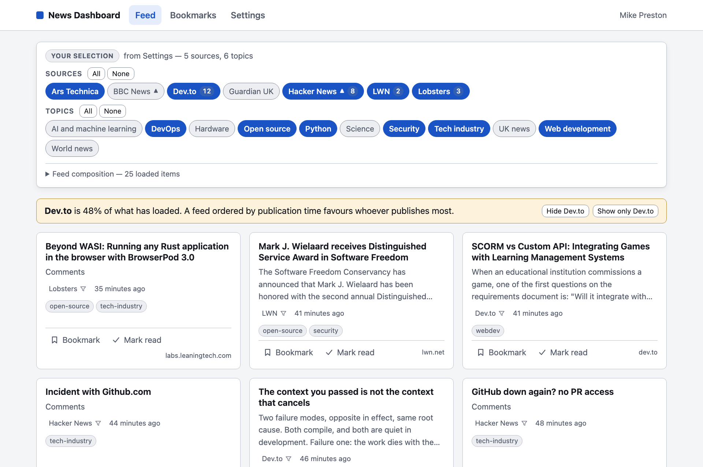
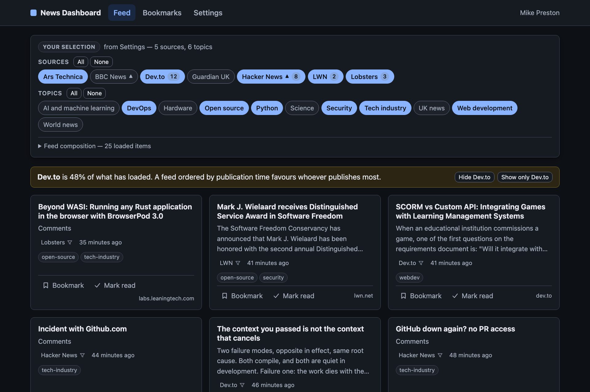

# Developer News Dashboard

[](https://github.com/Darkflib/sre-tab/actions/workflows/ci.yml)
[](https://github.com/Darkflib/sre-tab/actions/workflows/docs.yml)

One private place for developer news. **sre-tab** is a small self-hosted
service that pulls a curated set of RSS and Atom feeds into a single
filtered stream, and keeps your topic selections, your bookmarks, and
what you have already read on a server you run.

| Light | Dark |
| --- | --- |
|  |  |

## Why

Developer news is spread across a dozen sites, and the usual fix is a hosted
aggregator: one page, in exchange for your preferences and your reading
history living on somebody else's server. Which stories you opened, what you
kept, what you skipped. For plenty of people that is a fair trade. For the
rest the fallback has generally been a browser tab full of bookmarks.

sre-tab is the aggregation without the trade — one small service you host
yourself:

- **Sign-in is GitHub OAuth against an allow-list you control.** There is no
  public sign-up. An empty allow-list admits nobody — see
  [the first-deploy trap](#the-two-things-that-look-like-bugs) below.
- **Preferences, bookmarks, and read state live in your database**, not in
  someone else's. `DELETE /api/v1/me` removes all of it, including sessions.
- **Nothing phones home.** No analytics, no ads, no affiliate links, no
  telemetry. The only outbound traffic is the feed fetcher pulling the
  sources you configured, and the OAuth exchange with GitHub at sign-in.
- **Sources are operator-managed, not user-supplied.** That is a deliberate
  restriction: accepting arbitrary RSS URLs from users would make this an
  SSRF proxy with a login page. Feed URLs are validated against the full
  guard when the operator adds them, before anything is ever fetched.

The full framing, scope, and acceptance criteria are in
[prd-v1.md](prd-v1.md).

<a id="quickstart"></a>
## Quickstart

Python 3.12+, [uv](https://docs.astral.sh/uv/), and Node 20.19+. Nothing
else — v1 development runs against SQLite and needs no container, no
database server, and no GitHub OAuth app until you want to sign in.

### Set it up

<!-- docs:run -->

```sh
uv sync                          # create .venv and install everything
cp .env.example .env             # the defaults suit local development
uv run alembic upgrade head      # create the SQLite development database
uv run sre-tab seed              # install the topic and source catalogue
```

<!-- docs:run -->

```sh
cd frontend && npm ci            # the client's dependencies
```

`sre-tab seed` matters more than it looks: a freshly migrated database has
no sources and no topics, so without it the feed is empty and onboarding
offers nothing to tick. It is idempotent and never overwrites a row an
operator has changed.

### Run it

Two processes, two terminals. The API:

<!-- docs:run background ready=http://localhost:8000/api/v1/healthz -->

```sh
uv run uvicorn app.main:app --reload
```

and the client:

<!-- docs:run background ready=http://localhost:5173/ -->

```sh
cd frontend && npm run dev
```

### Check it

<!-- docs:run -->

```sh
curl --fail --silent http://localhost:8000/api/v1/healthz
curl --fail --silent http://localhost:5173/api/v1/healthz
uv run sre-tab sources list
```

The application is at <http://localhost:5173>. The Vite dev server proxies
`/api` to the API on port 8000, which is what the second `curl` above
demonstrates — the browser sees one origin in development exactly as it
does in production, and no CORS configuration exists anywhere in the
project.

`/api/v1/healthz` answers liveness and readiness separately and names each
probe, so a 503 says *which* dependency is unhappy. Every other route under
`/api/v1` requires a session and answers `401` without one. The OpenAPI
schema is always served, at `/api/v1/openapi.json`; the interactive Swagger
UI at `/docs` is governed by `DOCS_ENABLED`, which `.env.example` turns on
because that file is the development template.

To get past the landing page you need a GitHub OAuth app: register one with
callback `http://localhost:8000/api/v1/auth/github/callback`, then set
`GITHUB_CLIENT_ID`, `GITHUB_CLIENT_SECRET`, and your own numeric GitHub ID
in `ALLOWED_GITHUB_IDS`. Every setting is documented in
[.env.example](.env.example).

Feeds refresh on a timer once the application is running. `uv run sre-tab
status` reports what each source last did, and exits non-zero when an
enabled source is failing so a monitoring job can call it and mean it.

## Architecture

```
                browser
                   │  one origin: HttpOnly session cookie, CSRF header
                   ▼
        ┌──── reverse proxy (Caddy) ────┐
        │  /            → frontend/dist │
        │  /api/*,/docs → FastAPI       │
        └───────────────┬───────────────┘
                        ▼
        ┌──── FastAPI (uvicorn, one process) ────┐
        │  /api/v1 routers → services → session  │
        │  APScheduler thread: refresh, prune    │
        └───────────────┬────────────────────────┘
                        ▼
              PostgreSQL (SQLite in dev)
```

- **Backend** — Python 3.12+, FastAPI, Pydantic v2, SQLAlchemy 2.x (sync, 2.0
  style), Alembic, managed with `uv`. SQLite for local development and the
  test suite; PostgreSQL in production.
- **Frontend** — React 19 and Vite, TypeScript generated from the frozen
  `openapi.json` rather than hand-written, so a contract change surfaces as a
  type error instead of a runtime surprise. Served same-origin with the API.
- **Auth** — GitHub OAuth authorisation-code flow, entirely server-side. The
  browser never sees the client secret or the access token. Sessions are a
  `HttpOnly`, `Secure`, `SameSite=Lax` cookie; only a hash of the token is
  stored. Mutating routes require a signed double-submit CSRF token bound to
  the session it was issued for.
- **Ingest** — RSS and Atom only. Every fetch runs an SSRF guard first:
  https only, DNS resolved and private, link-local, and reserved ranges
  refused, every redirect hop re-checked, short timeouts, a response-size cap
  counted in wire bytes, and summaries sanitised to text rather than rendered
  as feed HTML.
- **Scheduling** — APScheduler in the application process, not a separate
  worker and emphatically not Celery. A one-minute tick asks the database
  which sources are due; each is refreshed under a per-source PostgreSQL
  advisory lock, so replicas never fetch the same source concurrently. On
  SQLite there is no advisory-lock equivalent, so the lock degrades to
  process-local and logs a warning once at start-up rather than pretending.

[ARCHITECTURE.md](ARCHITECTURE.md) draws all of that properly — the request
path through the middleware, the sign-in exchange, the SSRF guard's decision
order, the schema, and the route from a commit to a running host — and, at
the end, a table naming the single place each of these properties is actually
enforced.

<a id="the-two-things-that-look-like-bugs"></a>
## The two things that look like bugs

Both are correct behaviour. Both are indistinguishable from a fault if you
have not seen them before, which is why they are here on the front page.

### An empty `ALLOWED_GITHUB_IDS` denies everyone

v1 sign-in is allow-list only: a comma-separated list of **numeric** GitHub
user IDs, checked at the OAuth callback before any user record is created.
The list ships empty in [.env.example](.env.example), and empty means nobody
— including you. The GitHub authorisation succeeds, the browser comes back
to `/api/v1/auth/github/callback`, and the response is a bare `403` saying
the account is not permitted to sign in. It reads like a broken OAuth
application. It is the allow-list working.

Find your ID at `https://api.github.com/users/<login>` — the `id` field, not
your login name, because a login can be changed and reused and a numeric ID
cannot.

### A source whose origin redirects to `http://` can never work

The fetcher is https-only on every hop, redirect hops included. A feed URL
that answers `301` with an `http://` location is therefore refused at the
downgrade — correctly, and with the reason logged. Nothing about the URL as
typed predicts it, and `sre-tab sources add` cannot predict it either: doing
so would need the very request the add-time check deliberately does not make.

A trailing slash is the usual way to land on one. This is real, not
hypothetical:

```
https://www.theguardian.com/uk/rss/   → 301 http://www.theguardian.com/uk/rss   refused
https://www.theguardian.com/uk/rss    → 200                                     fine
```

The source is accepted at add time, then shows `failing (1)` in `sre-tab
status` with `UnsafeTargetError: refused scheme … (scheme 'http' is not
https)`, and the CLI exits non-zero. If a source never fetches, request its
feed URL by hand and read the `Location` header before concluding the feed
is down. There is more on this, and on the rest of the operator CLI, in
[deploy/README.md](deploy/README.md#seeding-the-catalogue-and-the-operator-cli).

<a id="calling-the-api-from-another-application"></a>
## Calling the API from another application

Every route under `/api/v1` accepts a per-user API token as well as the
browser's session cookie, so a script, a status board, or a terminal can read
your feed without holding your GitHub session.

Create one under **Settings → API tokens**. You choose a label, an expiry if
you want one, and — the part worth pausing on — a scope:

| Scope | What it can do | When to use it |
| --- | --- | --- |
| **Read only** | `GET` and nothing else | Anything that displays your feed. Almost everything. |
| **Full access** | Everything your account can do through the API, including deleting it — but *not* managing tokens, which needs the browser session | Only when the other application genuinely writes. |

The difference is the whole blast radius of a leak. A read-only token that
gets into a log file discloses what you read; a full-access one is your
account. Pick read-only unless you know you are writing.

**The token is shown once, at creation, and never again.** Only a SHA-256
digest of it is stored, the way session tokens already are, so the server
cannot show it to you a second time — if you lose it, revoke it and make
another. Every token starts `sretab_pat_`, which is there so it is greppable
and so a secret scanner can recognise one in a repository.

Send it as an ordinary bearer credential:

```sh
curl --silent --header "Authorization: Bearer $SRE_TAB_TOKEN" \
  https://news.example.com/api/v1/feed?limit=5
```

No CSRF header is needed, because there is no cookie: CSRF is enforced on
requests carrying the session cookie, and a bearer request has none.

Four things to expect, none of which is a fault:

- **A refused token is always `401 {"detail": "Not signed in"}`.** Unknown,
  malformed, revoked, expired, and "the owner is no longer on
  `ALLOWED_GITHUB_IDS`" all answer identically, on purpose — which of the
  five it was is not information a caller is entitled to.
- **A read-only token gets `403` on any `POST`, `PUT`, `PATCH`, or `DELETE`,**
  with a message saying so. This is decided before the route runs, so it
  applies to every endpoint, including ones added after you read this.
- **Removing an account from the allow-list kills its tokens immediately.**
  The list is consulted on every request, not only at sign-in, so revoking
  someone's access does not leave a credential behind that outlives it.
- **Tokens cannot be managed with a token.** `/api/v1/me/tokens` requires the
  browser session and answers `403` to a bearer credential, however
  privileged. That is what makes revoking a leaked token mean something: its
  holder could otherwise have issued themselves a replacement.

## Deploying

A single Podman host with system Quadlets: PostgreSQL, a migration oneshot,
the application, Caddy, and a nightly backup timer, each container running
as an unprivileged numeric user with a read-only root filesystem and all
capabilities dropped. Terminate TLS at your existing proxy and forward to
`127.0.0.1:8080` — or wherever `SRE_TAB_WEB_PORT` in `/etc/sre-tab/install.env`
puts it, which is what a host with 8080 already taken wants. Only the host
side moves; see
[the published port](deploy/README.md#the-published-port).

[deploy/README.md](deploy/README.md) is the operational manual — topology,
secrets, migrations on deploy, backup and a **tested** restore, the
client-address chain, and the failure modes that have actually bitten. Read
it before the first deploy rather than during it.

<a id="installing-a-version"></a>
### Installing a version

Published builds live at `ghcr.io/darkflib/sre-tab`, under four kinds of tag:

| Tag | Points at | Moves |
| --- | --- | --- |
| `1.1.0` | the release of that exact version | never |
| `1.1` | the newest patch of the 1.1 line | on each 1.1.x release |
| `latest` | the tip of `main` | on every merge |
| `sha-<commit>` | one commit's build | never |

`1.1.0` is the one to ask for. `1.1` is a convenience for anyone who wants
patch releases without watching for them, and it is a *moving* pointer: what
it resolves to changes underneath you, so a restart can change the version
you are running. A pre-release never moves it — `v1.1.0-rc1` publishes
`1.1.0-rc1` and nothing else, because someone asking for the stable minor
line has not asked to be given a release candidate.

Every release also has a [GitHub
Release](https://github.com/Darkflib/sre-tab/releases) carrying that
version's changelog section and its SPDX SBOM.

**The reference deployment pins a digest instead, and that is deliberate.**
The Quadlets under `deploy/` name `sre-tab:sha-<commit>@sha256:…`, so an
upgrade is a reviewed commit rather than a restart, and podman refuses
anything that does not hash to the pinned digest.
[deploy/scripts/promote.sh](deploy/scripts/promote.sh) is what writes those
pins, and it refuses to write one cosign cannot verify. A version tag is a
name for a build; a digest *is* the build.

## Known gaps

What v1 ships without, and what it ships without having proved. The second
list is the one worth reading — everything on it is believed correct and has
not been demonstrated, which is a different thing from being tested.

- **The backup timer's catch-up is untested.** `sre-tab-backup.timer` sets
  `Persistent=true` so a host that was off overnight takes its backup on the
  way back up; demonstrating that needs the host down across 03:22 UTC, which
  has not happened yet. The backup and restore *scripts* are exercised on
  every push — CI runs the real ones against a throwaway database and asserts
  the data comes back — so what is unproven is the scheduling, not the dump.
- **The fetcher's accept-a-redirect branch has never run against a real
  server.** An https → https redirect is followed, with the destination
  re-validated and re-pinned in its own right. That branch is covered by unit
  tests against a mocked transport, including a relative `Location`; what it
  has not had is a live feed, because none of the nineteen candidate sources
  surveyed redirects at all. The refusal branches — downgrade to `http`, a
  private or link-local destination, a `file:` URL, a loop, a `Location`-less
  `302` — are the ones with real-world provenance.
- **Frontend coverage stops at the components.** The Vitest suite under
  `frontend/` is gated in CI and covers the theme layer thoroughly —
  resolution and its storage fallbacks, the anti-flash script executed in a
  VM context, and WCAG contrast recomputed from `tokens.css` for both themes
  — the feed's filter model and volume signals, the fetch layer
  (`src/api/client.ts`), and the pagination hook's effects
  (`src/data/usePagedResource.ts`), the last two under a per-file
  `happy-dom` environment. Exactly one screen is now mounted and asserted
  against the DOM: `src/routes/ApiTokensSection.tsx`, because it is the only
  one that handles a credential. The rest of `src/routes/` and all of
  `src/components/` remain uncovered — nothing else renders a screen and
  asserts what a user would see.
- **Backups sit on the same host as the database.** That is a backup, not
  disaster recovery. The `.sha256` sidecars exist so a copy taken off-host
  can be verified at the far end.
- **The Quadlet units have had three cold installs, not a long soak.** Unit
  generation is machine-checked in CI with `podman-system-generator --dryrun`,
  which catches a malformed key and nothing about runtime behaviour; the rest
  — the ordering, `Notify=healthy`, the podman secret plumbing, and both
  timer-driven jobs — has been exercised by hand on Debian 13 hosts. What no
  run has yet covered is the timers firing on their own, or catching up after
  the host has been off overnight.
- **Two of the five reviewed security findings are open by decision, not by
  oversight.** They are held open by the shape of this deployment — one
  instance, three allow-listed operators, a catalogue only the CLI can add to
  — and the assumption behind each is written down next to it in
  [ROADMAP.md](ROADMAP.md#security-findings-this-deployment-absorbs). Read
  that section before adding an operator, a second instance, or a route that
  accepts a feed URL.

  The one finding that did *not* depend on the operator count is now closed:
  the application used to connect to PostgreSQL as the cluster superuser,
  which would have turned any future SQL injection into command execution
  inside the database container. Every unit but the database now connects as
  one of three non-superuser roles — DML for the application, DDL for the
  migration unit, read-only for the backup — and none of them can
  `COPY … TO PROGRAM`. [deploy/ROLES.md](deploy/ROLES.md) is the whole
  picture.

[ROADMAP.md](ROADMAP.md) is the full list of what was deliberately deferred
and why.

## Not in v1

Set expectations before you clone it. v1 deliberately excludes browser
extensions and new-tab replacement, per-device preference overrides, Google
or email sign-in, ads, payments, and telemetry, AI ranking and personalised
recommendations, social features and notifications, user-supplied RSS URLs,
and any compatibility with the Hackertab application this replaces. The
reasoning for each is in [prd-v1.md](prd-v1.md#non-goals-for-v1).

## Documentation

| Document | What it covers |
| --- | --- |
| [ARCHITECTURE.md](ARCHITECTURE.md) | The system in diagrams: request path, ingest, schema, deployment |
| [prd-v1.md](prd-v1.md) | Product requirements: scope, data model, acceptance criteria |
| [PLAN-v1.md](PLAN-v1.md) | How v1 was decomposed across parallel agents, and why |
| [ROADMAP.md](ROADMAP.md) | Deferred work, grouped by why it was deferred |
| [deploy/README.md](deploy/README.md) | Operational manual for the Podman deployment |
| [frontend/README.md](frontend/README.md) | Client architecture, CSP constraints, the generated API client |
| [CONTRIBUTING.md](CONTRIBUTING.md) | The gate, the PR expectations, how to work on this |
| [AGENTS.md](AGENTS.md) | Binding rules for agents working in this repository |
| [CHANGELOG.md](CHANGELOG.md) | What changed, in Keep a Changelog form |

## Layout

| Path | Purpose |
| --- | --- |
| `app/api/v1/` | Versioned API: routers and frozen Pydantic schemas |
| `app/auth/` | OAuth flow, sessions, CSRF, allow-list, rate limiting |
| `app/ingest/` | SSRF guard, fetch, parse, normalise, store |
| `app/scheduler/` | APScheduler service and the advisory-lock leader strategy |
| `app/services/` | Feed, preferences, bookmarks, read state |
| `app/cli/` | Operator CLI (`sre-tab`) and the seed catalogue |
| `app/db/` | Engine, session factory, ORM models |
| `alembic/` | Migration environment and revisions |
| `frontend/` | React client |
| `deploy/` | Quadlets, Caddyfile, install and backup/restore scripts |
| `tests/` | Pytest suite; root `conftest.py` holds shared fixtures |

## Contributing

The gate is five commands, and all five have to pass before a commit:

<!-- docs:run -->

```sh
uv run ruff format --check .
uv run ruff check .
uv run mypy .
uv run pytest
uv run bandit -c pyproject.toml -r app
```

That block is executed by the docs workflow along with the quickstart above,
so it cannot quietly stop being the real gate.

[CONTRIBUTING.md](CONTRIBUTING.md) has the rest: the client's own checks,
the PostgreSQL suite and the deployment smoke test, branch protection, commit
expectations, and how `AGENTS.md` fits in.
